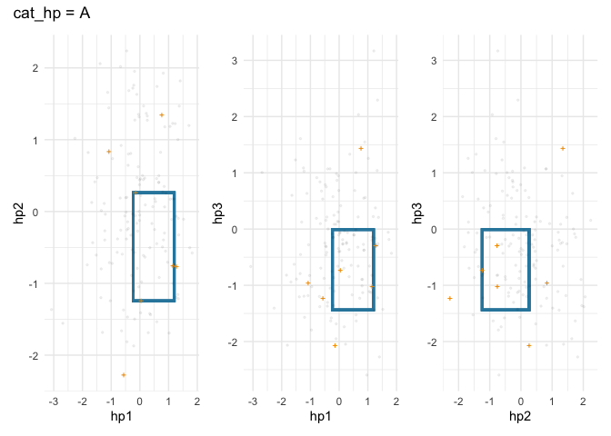

<!-- README.md is generated from README.Rmd. Please edit that file -->

# spacefinder

<!-- badges: start -->

<!-- badges: end -->

Spacefinder provides functionality to identify best performing minimum
volume subspaces within the hyperparameter space.

## Installation

You can install the development version of spacefinder from
[GitHub](https://github.com/) with:

``` r
# install.packages("pak")
pak::pak("NikoGerman/spacefinder")
```

## Example

``` r
library(spacefinder)

withr::with_seed(1, DT <- data.table::data.table(
      task = sample(c("T1", "T2", "T3"), 300, replace = TRUE),
      auc = sample(runif(30), 100, replace = TRUE),
      hp1 = rnorm(300),
      hp2 = rnorm(300),
      hp3 = rnorm(300),
      cat_hp = sample(c("A", "B"), 300, replace = TRUE)
      )
    )

tsk <- as_task_subspace(DT, auc ~ (hp1 + hp2 + hp3) * cat_hp)

learner <- LearnerSubspaceBox$new(tsk)

# train with slack
learner$train(lambda = .05)
```

``` r
summary(learner)
#> SUMMARY
#> --------------------------
#> Property                      Value         
#> ----------------------------  --------------
#> Target Measure                auc           
#> Numeric Hyperparameters       hp1, hp2, hp3 
#> Categorical Hyperparameters   cat_hp        
#> 
#> 
#> Coefficients:
#> --------------------------
#> cat_hp   hyperparameter           min         max
#> -------  ---------------  -----------  ----------
#> B        hp1                0.5606005   1.6346443
#> B        hp2               -0.7233750   0.9644541
#> B        hp3               -0.7424822   0.5593342
#> A        hp1               -1.4520283   1.0479482
#> A        hp2               -0.2085919   1.3771547
#> A        hp3               -0.9911609   1.5088496
#> 
#> 
#> Status:
#> --------------------------
#> cat_hp   status     objective_value   n_violations   observations
#> -------  --------  ----------------  -------------  -------------
#> B        optimal          0.1676549              1              4
#> A        optimal           0.585847              2              4
```

``` r
ggplot2::autoplot(learner, wrap = TRUE)$A
```



``` r
outliers(learner)
#>      task       auc        hp1        hp2        hp3 cat_hp
#>    <char>     <num>      <num>      <num>      <num> <char>
#> 1:     T1 0.9937492  0.3587742 -0.9252012 -0.5814342      B
#> 2:     T2 0.9937492 -1.5384414 -0.2950050  2.1722442      A
#> 3:     T3 0.9543781  1.2938800 -0.1578272 -1.6792916      A
```
