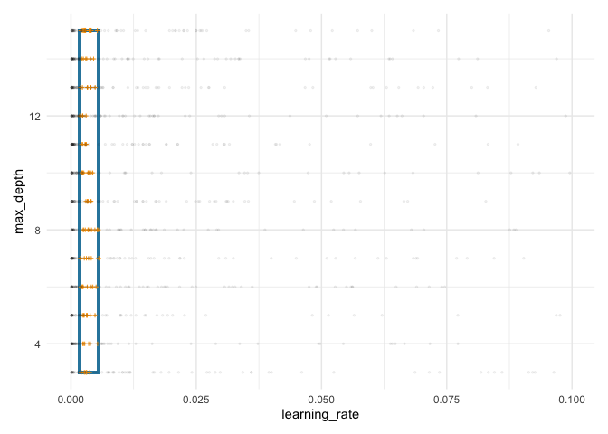

<!-- README.md is generated from README.Rmd. Please edit that file -->

# spacefinder

<!-- badges: start -->

<!-- badges: end -->

## Overview

`spacefinder` identifies promising subspaces within hyperparameter
spaces by fitting geometric regions (hyperrectangles and ellipsoids) to
high-performing configurations from hyperparameter tuning benchmarks.

**Key features:**

- Three learner types: Box (axis-aligned), Polygon (oriented), and
  Ellipsoid
- Handles categorical hyperparameters by fitting separate subspaces per
  level
- Beta density estimation for probabilistic sampling (`augment()`)
- Visualization tools for fitted subspaces (`autoplot()`)
- Works with multi-task benchmark data

## Installation

Install the development version from GitHub:

``` r
# install.packages("pak")
pak::pak("NikoGerman/spacefinder")
```

## Quick Start

``` r
library(spacefinder)

# Load example data
data(benchmark_data)

# Create task
task <- TaskSubspace$new(
  data = benchmark_data,
  target_measure = "auc",
  hps = c("learning_rate", "max_depth")
)

# Fit axis-aligned hyperrectangle
learner <- LearnerSubspaceBox$new(task)
learner$train(q_val = 0.9)

# View fitted bounds
coef(learner)
#>    hyperparameter         min         max
#>            <char>       <num>       <num>
#> 1:  learning_rate 0.001746421  0.00554191
#> 2:      max_depth 3.000000000 15.00000000
```

``` r
# Visualize fitted subspace
ggplot2::autoplot(learner)
```



## Documentation

Learn more about spacefinder:

- `vignette("getting-started", package = "spacefinder")` - Basic
  workflow and concepts
- `vignette("learner-comparison", package = "spacefinder")` - Comparing
  Box, Polygon, and Ellipsoid learners  
- `vignette("categorical-hyperparameters", package = "spacefinder")` -
  Working with categorical variables
- `vignette("density-estimation", package = "spacefinder")` -
  Probabilistic modeling with `augment()`

Or browse online at <https://nikogerman.github.io/spacefinder/>

## Citation

If you use spacefinder in your research, please cite:

    @Manual{,
      title = {spacefinder: Subspace Learning for Hyperparameter Optimization},
      author = {Nikolai German},
      year = {2025},
      note = {R package version 0.2.0},
      url = {https://github.com/NikoGerman/spacefinder},
    }

## License

Apache License v2.0
