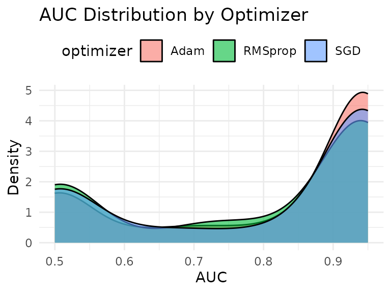
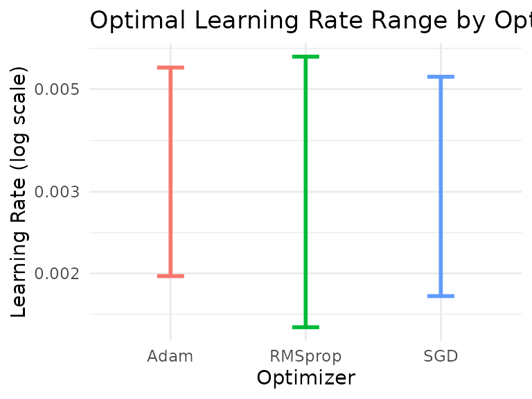
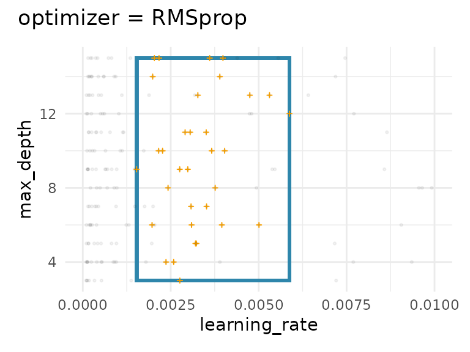
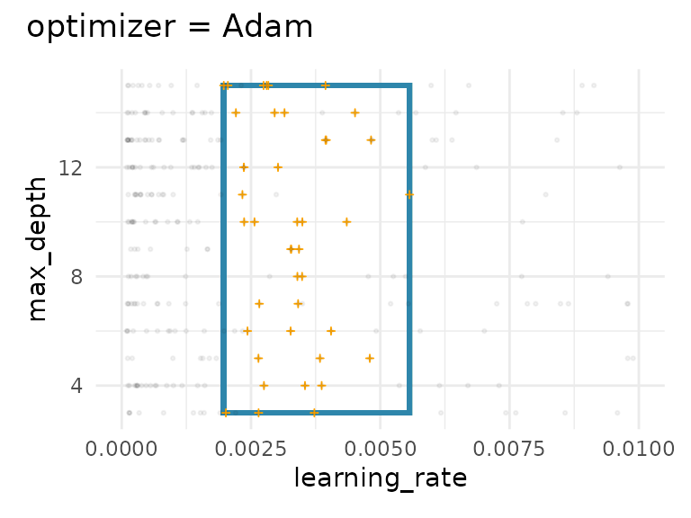
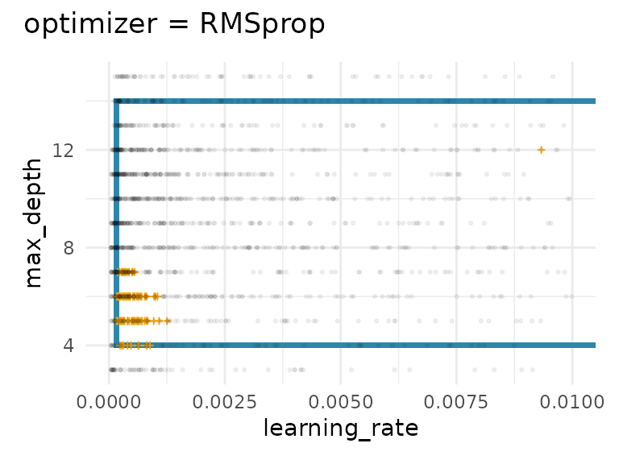
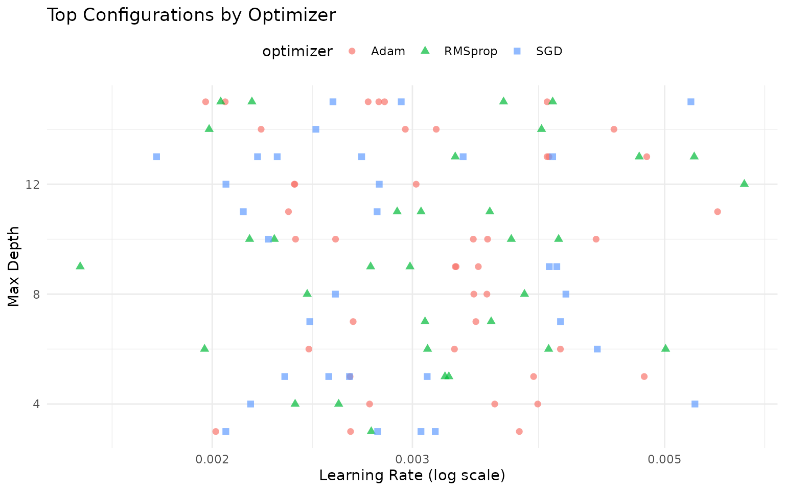

# Working with Categorical Hyperparameters

``` r
library(spacefinder)
library(data.table)
library(ggplot2)
data(benchmark_data)
```

## Introduction

Many hyperparameter optimization scenarios involve categorical
hyperparameters like optimizer type, activation function, or kernel
choice. The `spacefinder` package handles these by fitting separate
subspaces for each categorical level.

## The Data

The `benchmark_data` includes three optimizers: SGD, Adam, and RMSprop.
Let’s explore how they differ:

``` r
# Performance by optimizer
benchmark_data[, .(
  mean_auc = mean(auc),
  median_auc = median(auc),
  sd_auc = sd(auc),
  max_auc = max(auc),
  n = .N
), by = optimizer]
#>    optimizer  mean_auc median_auc     sd_auc max_auc     n
#>       <char>     <num>      <num>      <num>   <num> <int>
#> 1:       SGD 0.8346208  0.8554099 0.11751028       1  2500
#> 2:      Adam 0.6010436  0.5762377 0.09207576       1  2500
#> 3:   RMSprop 0.6884296  0.6504798 0.14778183       1  2500

# Visualize distributions
ggplot(benchmark_data, aes(x = auc, fill = optimizer)) +
  geom_density(alpha = 0.6) +
  theme_minimal() +
  labs(title = "AUC Distribution by Optimizer",
       x = "AUC", y = "Density") +
  theme(legend.position = "top")
```



Notice that Adam tends to achieve slightly higher performance than SGD
and RMSprop.

## Creating a Task with Categorical Hyperparameters

Include the categorical hyperparameter in the task definition:

``` r
# Explicit specification
task <- TaskSubspace$new(
  data = benchmark_data,
  target_measure = "auc",
  hps = c("learning_rate", "max_depth"),
  cat_hps = "optimizer"
)

# Formula interface and convenience function
task <- as_task_subspace(
  data = benchmark_data,
  formula = auc ~ (learning_rate + max_depth) * optimizer
)
```

The `* optimizer` in the formula indicates that separate subspaces
should be fitted for each optimizer type.

## Fitting Separate Subspaces

Train a learner - it will automatically fit one subspace per optimizer:

``` r
learner <- LearnerSubspaceBox$new(task)
learner$train(q_val = 0.9)
```

## Examining Results per Category

### Coefficients

The coefficients now show separate bounds for each optimizer:

``` r
bounds <- coef(learner)
print(bounds)
#>    optimizer hyperparameter          min         max
#>       <char>         <char>        <num>       <num>
#> 1:       SGD  learning_rate 0.0000646238  0.06077546
#> 2:       SGD      max_depth 3.0000000000 15.00000000
#> 3:      Adam  learning_rate 0.0008549492  0.01177603
#> 4:      Adam      max_depth 7.0000000000 11.00000000
#> 5:   RMSprop  learning_rate 0.0001591802  0.07528367
#> 6:   RMSprop      max_depth 4.0000000000 14.00000000
```

Notice how different optimizers have different optimal ranges!

``` r
# Compare learning rate ranges
bounds[hyperparameter == "learning_rate"] |>
  ggplot(aes(optimizer, color = optimizer)) +
  geom_errorbar(aes(ymin = min, ymax = max), width = 0.2, linewidth = 1) +
  scale_y_log10() +
  theme_minimal() +
  labs(title = "Optimal Learning Rate Range by Optimizer",
       y = "Learning Rate (log scale)", x = "Optimizer") +
  theme(legend.position = "none")
```



### Summary

The summary shows fitting statistics for each optimizer:

``` r
summary(learner)
#> SUMMARY
#> -------------------------------------------------- 
#> Property                      Value                    
#> ----------------------------  -------------------------
#> Target Measure                auc                      
#> Numeric Hyperparameters       learning_rate, max_depth 
#> Categorical Hyperparameters   optimizer                
#> 
#> 
#> COEFFICIENTS
#> -------------------------------------------------- 
#> optimizer   hyperparameter          min          max
#> ----------  ---------------  ----------  -----------
#> SGD         learning_rate     0.0000646    0.0607755
#> SGD         max_depth         3.0000000   15.0000000
#> Adam        learning_rate     0.0008549    0.0117760
#> Adam        max_depth         7.0000000   11.0000000
#> RMSprop     learning_rate     0.0001592    0.0752837
#> RMSprop     max_depth         4.0000000   14.0000000
#> 
#> 
#> STATUS
#> -------------------------------------------------- 
#> optimizer   status    objective_value   n_violations   observations
#> ----------  -------  ----------------  -------------  -------------
#> SGD         NULL                 NULL           NULL            250
#> Adam        NULL                 NULL           NULL            250
#> RMSprop     NULL                 NULL           NULL            250
```

Each optimizer gets its own row in the status table, showing: - Number
of observations used - Performance across tasks

### Visualization

The autoplot function creates separate visualizations for each
optimizer:

``` r
lapply(autoplot(learner), \(plot) plot + scale_x_continuous(limits = c(0, .01)))
#> $SGD
```



    #> 
    #> $Adam



    #> 
    #> $RMSprop



Each panel shows: - The fitted subspace for that optimizer - Top
configurations for that optimizer (orange crosses) - All configurations
for that optimizer (gray points)

## Comparing Optimizers

Let’s analyze the differences between optimizers:

``` r
# Extract top configs per optimizer
top_configs_summary <- learner$top_configs[, .(
  mean_lr = mean(learning_rate),
  median_lr = median(learning_rate),
  mean_depth = mean(max_depth),
  median_depth = median(max_depth),
  mean_auc = mean(auc),
  n = .N
), by = optimizer]

print(top_configs_summary)
#>    optimizer     mean_lr   median_lr mean_depth median_depth  mean_auc     n
#>       <char>       <num>       <num>      <num>        <num>     <num> <int>
#> 1:       SGD 0.008340861 0.003586301      8.972            9 0.9888067   250
#> 2:      Adam 0.003784583 0.003486343      8.952            9 0.8105505   250
#> 3:   RMSprop 0.015224210 0.012173355      9.204           11 0.9642822   250
```

``` r
# Scatter plot colored by optimizer
ggplot(learner$top_configs, aes(x = learning_rate, y = max_depth, 
                                 color = optimizer, shape = optimizer)) +
  geom_point(size = 2, alpha = 0.7) +
  scale_x_log10() +
  theme_minimal() +
  labs(title = "Top Configurations by Optimizer",
       x = "Learning Rate (log scale)", y = "Max Depth") +
  theme(legend.position = "top")
```



## Next Steps

- **[`vignette("learner-comparison")`](https://nikogerman.github.io/spacefinder/articles/learner-comparison.md)**:
  Compare Box, Polygon, and Ellipsoid learners
- **[`vignette("density-estimation")`](https://nikogerman.github.io/spacefinder/articles/density-estimation.md)**:
  Add probabilistic density with `augment()`

``` r
sessionInfo()
#> R version 4.5.2 (2025-10-31)
#> Platform: x86_64-pc-linux-gnu
#> Running under: Ubuntu 24.04.3 LTS
#> 
#> Matrix products: default
#> BLAS:   /usr/lib/x86_64-linux-gnu/openblas-pthread/libblas.so.3 
#> LAPACK: /usr/lib/x86_64-linux-gnu/openblas-pthread/libopenblasp-r0.3.26.so;  LAPACK version 3.12.0
#> 
#> locale:
#>  [1] LC_CTYPE=C.UTF-8       LC_NUMERIC=C           LC_TIME=C.UTF-8       
#>  [4] LC_COLLATE=C.UTF-8     LC_MONETARY=C.UTF-8    LC_MESSAGES=C.UTF-8   
#>  [7] LC_PAPER=C.UTF-8       LC_NAME=C              LC_ADDRESS=C          
#> [10] LC_TELEPHONE=C         LC_MEASUREMENT=C.UTF-8 LC_IDENTIFICATION=C   
#> 
#> time zone: UTC
#> tzcode source: system (glibc)
#> 
#> attached base packages:
#> [1] stats     graphics  grDevices utils     datasets  methods   base     
#> 
#> other attached packages:
#> [1] ggplot2_4.0.1          data.table_1.18.0      spacefinder_0.2.2.0000
#> 
#> loaded via a namespace (and not attached):
#>  [1] Matrix_1.7-4       bit_4.6.0          gtable_0.3.6       jsonlite_2.0.0    
#>  [5] Rmpfr_1.1-2        compiler_4.5.2     Rcpp_1.1.0         jquerylib_0.1.4   
#>  [9] systemfonts_1.3.1  scales_1.4.0       textshaping_1.0.4  yaml_2.3.12       
#> [13] fastmap_1.2.0      lattice_0.22-7     R6_2.6.1           patchwork_1.3.2   
#> [17] labeling_0.4.3     generics_0.1.4     knitr_1.51         backports_1.5.0   
#> [21] checkmate_2.3.3    desc_1.4.3         bslib_0.9.0        RColorBrewer_1.1-3
#> [25] rlang_1.1.6        cachem_1.1.0       CVXR_1.0-15        xfun_0.55         
#> [29] S7_0.2.1           fs_1.6.6           sass_0.4.10        bit64_4.6.0-1     
#> [33] cli_3.6.5          withr_3.0.2        pkgdown_2.2.0      digest_0.6.39     
#> [37] grid_4.5.2         gmp_0.7-5          lifecycle_1.0.4    vctrs_0.6.5       
#> [41] evaluate_1.0.5     glue_1.8.0         farver_2.1.2       ragg_1.5.0        
#> [45] rmarkdown_2.30     tools_4.5.2        htmltools_0.5.9
```
