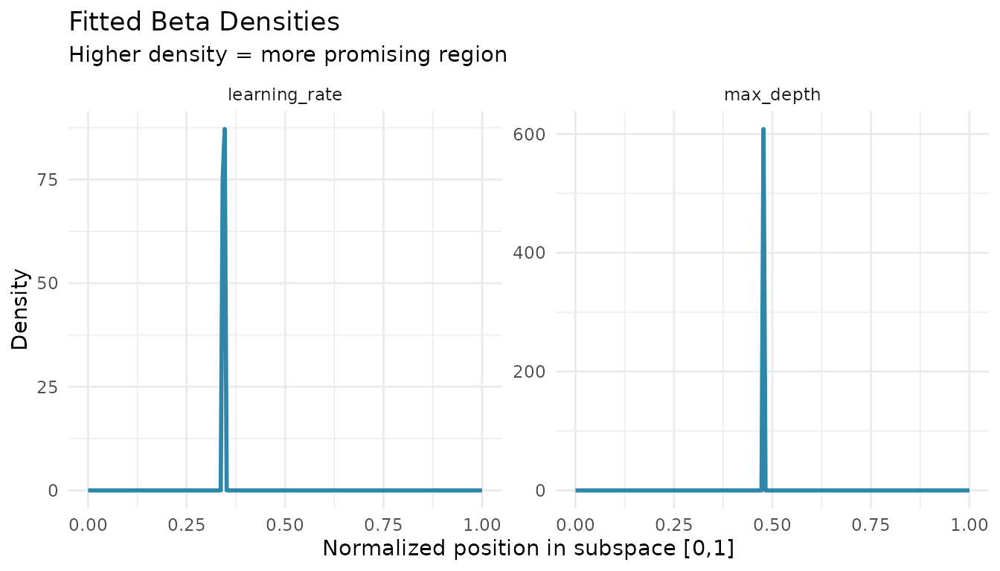

# Beta Density Estimation

``` r
library(spacefinder)
library(data.table)
library(ggplot2)
library(generics)
data("benchmark_data", package = "spacefinder")
```

## Introduction

After fitting a subspace, you can add probabilistic density information
using [`augment()`](https://generics.r-lib.org/reference/augment.html).
This fits Beta distributions to each hyperparameter dimension, allowing
you to:

- Sample new configurations weighted toward better regions
- Estimate probability densities within the subspace
- Understand which parts are most promising

**Note:**
[`augment()`](https://generics.r-lib.org/reference/augment.html) is only
available for **Box** and **Polygon** learners, not Ellipsoid.

## Basic Usage

``` r
# Train a box learner
task <- TaskSubspace$new(
  data = benchmark_data,
  target_measure = "auc",
  hps = c("learning_rate", "max_depth")
)

learner <- LearnerSubspaceBox$new(task)
learner$train(q_val = 0.9)

# Fit beta densities
densities <- augment(learner)
print(densities)
#>        parameter alpha     beta converged iterations
#>           <char> <num>    <num>    <lgcl>      <int>
#> 1: learning_rate     1 2.170536      TRUE          6
#> 2:     max_depth     1 1.000000      TRUE          6
```

The [`augment()`](https://generics.r-lib.org/reference/augment.html)
function returns fitted Beta distribution parameters (α, β) for each
hyperparameter.

## Understanding Beta Parameters

``` r
# Extract parameters for learning_rate
lr_params <- densities[parameter == "learning_rate"]
alpha <- lr_params$alpha
beta <- lr_params$beta

cat("Learning rate Beta(", alpha, ", ", beta, ")\n", sep = "")
#> Learning rate Beta(1, 2.170536)
cat("Mode at:", (alpha - 1) / (alpha + beta - 2), "\n")
#> Mode at: 0
```

- **α = β = 1**: Uniform distribution (all values equally likely)
- **α \> 1, β \> 1**: Peak in the interior (preferred region)
- **α \> β**: Peak toward 1 (prefers higher values in \[0,1\])
- **α \< β**: Peak toward 0 (prefers lower values in \[0,1\])

## Visualizing Densities

``` r
# Plot beta densities
x <- seq(0, 1, length.out = 200)

plot_data <- rbindlist(lapply(densities$parameter, function(hp) {
  params <- densities[parameter == hp]
  data.table(
    parameter = hp,
    x = x,
    density = dbeta(x, params$alpha, params$beta)
  )
}))

ggplot(plot_data, aes(x = x, y = density)) +
  geom_line(color = "#2E86AB", linewidth = 1) +
  facet_wrap(~parameter, scales = "free_y") +
  theme_minimal() +
  labs(title = "Fitted Beta Densities",
       subtitle = "Higher density = more promising region",
       x = "Normalized position in subspace [0,1]",
       y = "Density")
```



Higher density indicates regions where good configurations are more
concentrated.

## Sampling New Configurations

You can sample from the fitted distributions to generate new
hyperparameter configurations:

``` r
set.seed(123)
n_samples <- 5

# Get bounds
bounds <- coef(learner)
lr_bounds <- bounds[hyperparameter == "learning_rate"]
depth_bounds <- bounds[hyperparameter == "max_depth"]

# Sample from beta distributions (in [0,1])
lr_params <- densities[parameter == "learning_rate"]
depth_params <- densities[parameter == "max_depth"]

samples_unit <- data.table(
  learning_rate_unit = rbeta(n_samples, lr_params$alpha, lr_params$beta),
  max_depth_unit = rbeta(n_samples, depth_params$alpha, depth_params$beta)
)

# Transform to original scale
samples <- data.table(
  learning_rate = samples_unit$learning_rate_unit * 
    (lr_bounds$max - lr_bounds$min) + lr_bounds$min,
  max_depth = samples_unit$max_depth_unit * 
    (depth_bounds$max - depth_bounds$min) + depth_bounds$min
)

print(samples)
#>    learning_rate max_depth
#>            <num>     <num>
#> 1:   0.036267995  3.518000
#> 2:   0.027209084  6.869152
#> 3:   0.001976163 13.764904
#> 4:   0.019866312 12.046947
#> 5:   0.018574065 11.064951
```

These sampled configurations are weighted toward the most promising
regions.

## Regularization

By default,
[`augment()`](https://generics.r-lib.org/reference/augment.html) uses
`regularize = TRUE` to avoid U-shaped densities:

``` r
# With regularization (default)
densities_reg <- augment(learner, regularize = TRUE)

# Without regularization
densities_unreg <- augment(learner, regularize = FALSE)

cat("With regularization:\n")
#> With regularization:
print(densities_reg[, .(parameter, alpha, beta)])
#>        parameter alpha     beta
#>           <char> <num>    <num>
#> 1: learning_rate     1 2.170536
#> 2:     max_depth     1 1.000000

cat("\nWithout regularization:\n")
#> 
#> Without regularization:
print(densities_unreg[, .(parameter, alpha, beta)])
#>        parameter     alpha      beta
#>           <char>     <num>     <num>
#> 1: learning_rate 0.3671875 2.1705359
#> 2:     max_depth 0.6490467 0.6671625
```

Regularization enforces α ≥ 1 and β ≥ 1, ensuring the mode exists in the
interior of \[0,1\].

## Categorical Hyperparameters

When using categorical hyperparameters, separate densities are fitted
per level:

``` r
task_cat <- TaskSubspace$new(
  data = benchmark_data,
  target_measure = "auc",
  hps = c("learning_rate", "max_depth"),
  cat_hps = "optimizer"
)

learner_cat <- LearnerSubspaceBox$new(task_cat)
learner_cat$train(q_val = 0.9)

densities_cat <- augment(learner_cat)
print(densities_cat)
#>        parameter alpha     beta converged iterations optimizer
#>           <char> <num>    <num>    <lgcl>      <int>    <char>
#> 1: learning_rate     1 2.109833      TRUE          6       SGD
#> 2:     max_depth     1 1.000000      TRUE          7       SGD
#> 3: learning_rate     1 1.368952      TRUE          4      Adam
#> 4:     max_depth     1 1.000000      TRUE          6      Adam
#> 5: learning_rate     1 1.774986      TRUE          6   RMSprop
#> 6:     max_depth     1 1.000000      TRUE          8   RMSprop
```

Each optimizer gets its own Beta distribution parameters for each
hyperparameter.

## Polygon Learner

[`augment()`](https://generics.r-lib.org/reference/augment.html) also
works with Polygon learners:

``` r
learner_polygon <- LearnerSubspacePolygon$new(task)
learner_polygon$train(q_val = 0.9, lambda = 0.1)

densities_polygon <- augment(learner_polygon)
print(densities_polygon)
#>        parameter    alpha     beta converged iterations
#>           <char>    <num>    <num>    <lgcl>      <int>
#> 1: learning_rate 1.113984 1.153455      TRUE          3
#> 2:     max_depth 1.000000 1.178475      TRUE          7
```

The process is the same: data is transformed to the unit cube, then Beta
distributions are fitted.

## Summary

- [`augment()`](https://generics.r-lib.org/reference/augment.html) adds
  Beta density parameters to Box and Polygon learners
- Higher density indicates more promising regions
- Use fitted densities to sample new configurations
- Regularization (default) prevents U-shaped densities
- Works with categorical hyperparameters

## Next Steps

- [`vignette("learner-comparison")`](https://nikogerman.github.io/spacefinder/articles/learner-comparison.md):
  Compare Box, Polygon, and Ellipsoid learners
- [`vignette("categorical-hyperparameters")`](https://nikogerman.github.io/spacefinder/articles/categorical-hyperparameters.md):
  Handle categorical variables

``` r
sessionInfo()
#> R version 4.5.2 (2025-10-31)
#> Platform: x86_64-pc-linux-gnu
#> Running under: Ubuntu 24.04.3 LTS
#> 
#> Matrix products: default
#> BLAS:   /usr/lib/x86_64-linux-gnu/openblas-pthread/libblas.so.3 
#> LAPACK: /usr/lib/x86_64-linux-gnu/openblas-pthread/libopenblasp-r0.3.26.so;  LAPACK version 3.12.0
#> 
#> locale:
#>  [1] LC_CTYPE=C.UTF-8       LC_NUMERIC=C           LC_TIME=C.UTF-8       
#>  [4] LC_COLLATE=C.UTF-8     LC_MONETARY=C.UTF-8    LC_MESSAGES=C.UTF-8   
#>  [7] LC_PAPER=C.UTF-8       LC_NAME=C              LC_ADDRESS=C          
#> [10] LC_TELEPHONE=C         LC_MEASUREMENT=C.UTF-8 LC_IDENTIFICATION=C   
#> 
#> time zone: UTC
#> tzcode source: system (glibc)
#> 
#> attached base packages:
#> [1] stats     graphics  grDevices utils     datasets  methods   base     
#> 
#> other attached packages:
#> [1] generics_0.1.4         ggplot2_4.0.1          data.table_1.18.0     
#> [4] spacefinder_0.2.2.0000
#> 
#> loaded via a namespace (and not attached):
#>  [1] Matrix_1.7-4       bit_4.6.0          gtable_0.3.6       jsonlite_2.0.0    
#>  [5] Rmpfr_1.1-2        compiler_4.5.2     Rcpp_1.1.0         jquerylib_0.1.4   
#>  [9] systemfonts_1.3.1  scales_1.4.0       textshaping_1.0.4  yaml_2.3.12       
#> [13] fastmap_1.2.0      lattice_0.22-7     R6_2.6.1           labeling_0.4.3    
#> [17] knitr_1.51         backports_1.5.0    checkmate_2.3.3    desc_1.4.3        
#> [21] bslib_0.9.0        RColorBrewer_1.1-3 rlang_1.1.6        cachem_1.1.0      
#> [25] CVXR_1.0-15        xfun_0.55          S7_0.2.1           fs_1.6.6          
#> [29] sass_0.4.10        bit64_4.6.0-1      cli_3.6.5          withr_3.0.2       
#> [33] pkgdown_2.2.0      digest_0.6.39      grid_4.5.2         gmp_0.7-5         
#> [37] lifecycle_1.0.4    scs_3.2.7          vctrs_0.6.5        evaluate_1.0.5    
#> [41] glue_1.8.0         farver_2.1.2       ragg_1.5.0         rmarkdown_2.30    
#> [45] tools_4.5.2        htmltools_0.5.9
```
