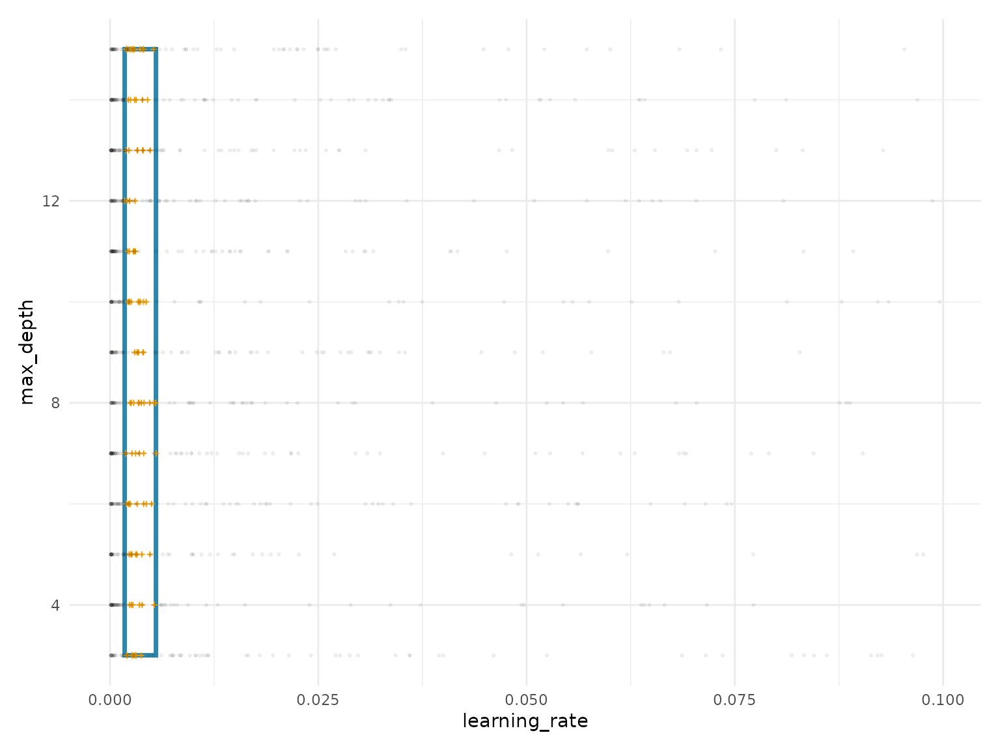

# Getting Started with spacefinder

``` r
library(spacefinder)
library(data.table)
library(ggplot2)
set.seed(42)
```

## Introduction

The `spacefinder` package helps you identify promising hyperparameter
subspaces from benchmark data. Instead of exploring the entire
hyperparameter space, you can focus on regions that consistently produce
high-performing models.

## Example Data

## Example Data

We’ll use the included `benchmark_data` dataset, which contains
synthetic hyperparameter tuning results:

``` r
data("benchmark_data", package = "spacefinder")
head(benchmark_data)
#>      task learning_rate max_depth optimizer       auc
#>    <char>         <num>     <num>    <char>     <num>
#> 1:  task1  1.669706e-03        11       SGD 0.8732184
#> 2:  task1  7.156343e-04        10       SGD 0.8407793
#> 3:  task1  3.214906e-03         8       SGD 0.9680098
#> 4:  task1  5.028091e-05         7       SGD 0.7771257
#> 5:  task1  1.855155e-03        12       SGD 0.8427566
#> 6:  task1  2.585816e-03         3       SGD 0.7729911

# Summary statistics
summary(benchmark_data$auc)
#>    Min. 1st Qu.  Median    Mean 3rd Qu.    Max. 
#>  0.5000  0.5672  0.6777  0.7080  0.8435  1.0000
cat("\nConfigurations with AUC > 0.9:", sum(benchmark_data$auc > 0.9), "\n")
#> 
#> Configurations with AUC > 0.9: 1241
```

The dataset includes: - 5 tasks (different datasets) - 200
configurations per task - Hyperparameters: `learning_rate`, `max_depth`,
`optimizer` - Performance: `auc` (Area Under ROC Curve)

## Creating a Task

Define a subspace task specifying the data, target measure, and
hyperparameters:

``` r
task <- TaskSubspace$new(
  data = benchmark_data,
  target_measure = "auc",
  hps = c("learning_rate", "max_depth")
)

# Alternative: formula interface
task <- TaskSubspace$new(
  data = benchmark_data,
  formula = auc ~ (learning_rate + max_depth)
)
```

## Training a Learner

We’ll use the Box learner, which fits axis-aligned hyperrectangles
(simple bounds per hyperparameter):

``` r
# Initialize learner
learner <- LearnerSubspaceBox$new(task)

# Train on top 10% of configurations
learner$train(q_val = 0.9)
```

The `q_val = 0.9` parameter means we use only configurations with
performance above the 90th percentile (top 10%) for each task.

## Extracting Results

### Coefficients

Get the fitted hyperparameter bounds:

``` r
bounds <- coef(learner)
print(bounds)
#>    hyperparameter          min         max
#>            <char>        <num>       <num>
#> 1:  learning_rate 5.064595e-05  0.06800025
#> 2:      max_depth 3.000000e+00 15.00000000
```

The learned optimal ranges: - `learning_rate`: between 0.0001 and
0.0680 - `max_depth`: between 3 and 15

### Summary

Get a comprehensive overview:

``` r
summary(learner)
#> SUMMARY
#> -------------------------------------------------- 
#> Property                      Value                    
#> ----------------------------  -------------------------
#> Target Measure                auc                      
#> Numeric Hyperparameters       learning_rate, max_depth 
#> Categorical Hyperparameters   None                     
#> 
#> 
#> COEFFICIENTS
#> -------------------------------------------------- 
#> hyperparameter         min          max
#> ---------------  ---------  -----------
#> learning_rate     5.06e-05    0.0680003
#> max_depth         3.00e+00   15.0000000
#> 
#> 
#> STATUS
#> -------------------------------------------------- 
#>  observations 
#>  -------------
#>  750
```

The summary shows: - **Summary**: Task information - **Coefficients**:
Fitted bounds - **Status**: Number of observations used for fitting

### Visualization

Visualize the fitted subspace:

``` r
autoplot(learner)
```



The plot shows: - **Blue rectangle**: Fitted subspace bounds - **Orange
crosses**: Top-performing configurations used for fitting - **Gray
points**: All configurations (background)

## Next Steps

Learn more about spacefinder:

- **[`vignette("categorical-hyperparameters")`](https://nikogerman.github.io/spacefinder/articles/categorical-hyperparameters.md)**:
  Handle categorical variables (e.g., optimizers)
- **[`vignette("learner-comparison")`](https://nikogerman.github.io/spacefinder/articles/learner-comparison.md)**:
  Compare Box, Polygon, and Ellipsoid learners
- **[`vignette("density-estimation")`](https://nikogerman.github.io/spacefinder/articles/density-estimation.md)**:
  Add probabilistic density with
  [`augment()`](https://generics.r-lib.org/reference/augment.html)

## Session Info

``` r
sessionInfo()
#> R version 4.5.2 (2025-10-31)
#> Platform: x86_64-pc-linux-gnu
#> Running under: Ubuntu 24.04.3 LTS
#> 
#> Matrix products: default
#> BLAS:   /usr/lib/x86_64-linux-gnu/openblas-pthread/libblas.so.3 
#> LAPACK: /usr/lib/x86_64-linux-gnu/openblas-pthread/libopenblasp-r0.3.26.so;  LAPACK version 3.12.0
#> 
#> locale:
#>  [1] LC_CTYPE=C.UTF-8       LC_NUMERIC=C           LC_TIME=C.UTF-8       
#>  [4] LC_COLLATE=C.UTF-8     LC_MONETARY=C.UTF-8    LC_MESSAGES=C.UTF-8   
#>  [7] LC_PAPER=C.UTF-8       LC_NAME=C              LC_ADDRESS=C          
#> [10] LC_TELEPHONE=C         LC_MEASUREMENT=C.UTF-8 LC_IDENTIFICATION=C   
#> 
#> time zone: UTC
#> tzcode source: system (glibc)
#> 
#> attached base packages:
#> [1] stats     graphics  grDevices utils     datasets  methods   base     
#> 
#> other attached packages:
#> [1] ggplot2_4.0.1          data.table_1.18.0      spacefinder_0.2.2.0000
#> 
#> loaded via a namespace (and not attached):
#>  [1] Matrix_1.7-4       bit_4.6.0          gtable_0.3.6       jsonlite_2.0.0    
#>  [5] Rmpfr_1.1-2        compiler_4.5.2     Rcpp_1.1.0         jquerylib_0.1.4   
#>  [9] systemfonts_1.3.1  scales_1.4.0       textshaping_1.0.4  yaml_2.3.12       
#> [13] fastmap_1.2.0      lattice_0.22-7     R6_2.6.1           labeling_0.4.3    
#> [17] patchwork_1.3.2    generics_0.1.4     knitr_1.51         backports_1.5.0   
#> [21] checkmate_2.3.3    desc_1.4.3         bslib_0.9.0        RColorBrewer_1.1-3
#> [25] rlang_1.1.6        cachem_1.1.0       CVXR_1.0-15        xfun_0.55         
#> [29] S7_0.2.1           fs_1.6.6           sass_0.4.10        bit64_4.6.0-1     
#> [33] cli_3.6.5          withr_3.0.2        pkgdown_2.2.0      digest_0.6.39     
#> [37] grid_4.5.2         gmp_0.7-5          lifecycle_1.0.4    vctrs_0.6.5       
#> [41] evaluate_1.0.5     glue_1.8.0         farver_2.1.2       ragg_1.5.0        
#> [45] rmarkdown_2.30     tools_4.5.2        htmltools_0.5.9
```
