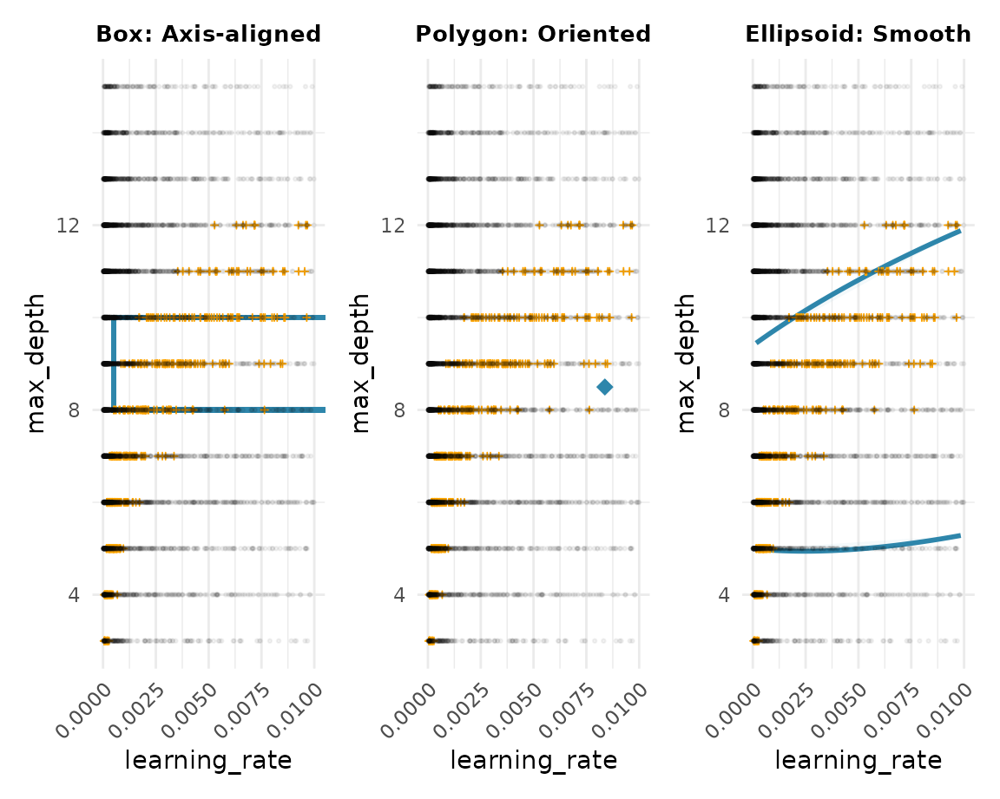

# Comparing Subspace Learners

``` r
library(spacefinder)
library(data.table)
library(ggplot2)
data("benchmark_data", package = "spacefinder")
```

## Introduction

The `spacefinder` package offers three learner types that differ in how
they represent promising hyperparameter regions:

- **Box**: Axis-aligned hyperrectangles (simple bounds per
  hyperparameter)
- **Polygon**: Oriented hyperrectangles (can rotate to capture
  correlations)
- **Ellipsoid**: Ellipsoids (smooth, curved boundaries)

Let’s see how they compare on the same data.

## Training All Three Learners

``` r
# Create task
task <- TaskSubspace$new(
  data = benchmark_data,
  target_measure = "auc",
  hps = c("learning_rate", "max_depth")
)

# Train all three learners with identical settings
learner_box <- LearnerSubspaceBox$new(task)
learner_box$train(q_val = 0.9, lambda = 0.1)

learner_polygon <- LearnerSubspacePolygon$new(task)
learner_polygon$train(q_val = 0.9, lambda = 0.1)

learner_ellipsoid <- LearnerSubspaceEllipsoid$new(task)
learner_ellipsoid$train(q_val = 0.9, lambda = 0.1)
```

## Visual Comparison

The best way to understand the differences is to visualize them:

``` r
p_box <- autoplot(learner_box) + 
  ggtitle("Box: Axis-aligned") +
  scale_x_continuous(limits = c(0, 0.01), breaks = seq(0, 0.01, by = 0.0025), guide = guide_axis(angle = 45)) +
  theme(plot.title = element_text(hjust = 0.5, face = "bold", size = 10))

p_polygon <- autoplot(learner_polygon) + 
  ggtitle("Polygon: Oriented") +
  scale_x_continuous(limits = c(0, 0.01), breaks = seq(0, 0.01, by = 0.0025), guide = guide_axis(angle = 45)) +
  theme(plot.title = element_text(hjust = 0.5, face = "bold", size = 10))

p_ellipsoid <- autoplot(learner_ellipsoid) + 
  ggtitle("Ellipsoid: Smooth") +
  scale_x_continuous(limits = c(0, 0.01), breaks = seq(0, 0.01, by = 0.0025), guide = guide_axis(angle = 45)) +
  theme(plot.title = element_text(hjust = 0.5, face = "bold", size = 10))

# Combine plots
patchwork::wrap_plots(p_box, p_polygon, p_ellipsoid, ncol = 3)
```



**Key differences:**

- **Box**: Simple rectangle aligned with axes - easiest to interpret
- **Polygon**: Can rotate to better fit the data - captures diagonal
  patterns
- **Ellipsoid**: Smooth curved boundary - most flexible fit

## Coefficients

### Box: Simple Bounds

``` r
coef(learner_box)
#> Index: <hyperparameter>
#>    hyperparameter          min         max
#>            <char>        <num>       <num>
#> 1:  learning_rate 0.0005110362  0.01208647
#> 2:      max_depth 8.0000000000 10.00000000
```

Box learners give you direct bounds: “use learning_rate between X and
Y”.

### Polygon and Ellipsoid: Transformation Matrices

``` r
# Polygon
coef(learner_polygon)
#>            hyperparameters                                           A
#>                     <list>                                      <list>
#> 1: learning_rate,max_depth 67.7775970,-0.3225274,-0.3225274, 0.2227666
#>                      b
#>                 <list>
#> 1:  2.172672,-1.890156

# Ellipsoid  
coef(learner_ellipsoid)
#>            hyperparameters                                           A
#>                     <list>                                      <list>
#> 1: learning_rate,max_depth 59.0010853,-0.1908523,-0.1908523, 0.2094325
#>                      b
#>                 <list>
#> 1:  0.795095,-2.034400
```

Polygon and Ellipsoid use transformation matrices **A** and **b**. These
are harder to interpret but allow more flexible shapes.

## Outliers

``` r
cat("Outliers identified:\n")
#> Outliers identified:
cat("  Box:", nrow(outliers(learner_box)), "\n")
#>   Box: 551
cat("  Polygon:", nrow(suppressMessages(outliers(learner_polygon))), "\n")
#>   Polygon: 99
cat("  Ellipsoid:", nrow(suppressMessages(outliers(learner_ellipsoid))), "\n")
#>   Ellipsoid: 120
```

Different learners may identify different configurations as outliers
based on their geometry.

## Next Steps

- [`vignette("density-estimation")`](https://nikogerman.github.io/spacefinder/articles/density-estimation.md):
  Add probabilistic density with
  [`augment()`](https://generics.r-lib.org/reference/augment.html)
- [`vignette("categorical-hyperparameters")`](https://nikogerman.github.io/spacefinder/articles/categorical-hyperparameters.md):
  Handle categorical variables

``` r
sessionInfo()
#> R version 4.5.2 (2025-10-31)
#> Platform: x86_64-pc-linux-gnu
#> Running under: Ubuntu 24.04.3 LTS
#> 
#> Matrix products: default
#> BLAS:   /usr/lib/x86_64-linux-gnu/openblas-pthread/libblas.so.3 
#> LAPACK: /usr/lib/x86_64-linux-gnu/openblas-pthread/libopenblasp-r0.3.26.so;  LAPACK version 3.12.0
#> 
#> locale:
#>  [1] LC_CTYPE=C.UTF-8       LC_NUMERIC=C           LC_TIME=C.UTF-8       
#>  [4] LC_COLLATE=C.UTF-8     LC_MONETARY=C.UTF-8    LC_MESSAGES=C.UTF-8   
#>  [7] LC_PAPER=C.UTF-8       LC_NAME=C              LC_ADDRESS=C          
#> [10] LC_TELEPHONE=C         LC_MEASUREMENT=C.UTF-8 LC_IDENTIFICATION=C   
#> 
#> time zone: UTC
#> tzcode source: system (glibc)
#> 
#> attached base packages:
#> [1] stats     graphics  grDevices utils     datasets  methods   base     
#> 
#> other attached packages:
#> [1] ggplot2_4.0.1          data.table_1.17.8      spacefinder_0.2.1.9003
#> 
#> loaded via a namespace (and not attached):
#>  [1] Matrix_1.7-4       bit_4.6.0          gtable_0.3.6       jsonlite_2.0.0    
#>  [5] Rmpfr_1.1-2        compiler_4.5.2     Rcpp_1.1.0         jquerylib_0.1.4   
#>  [9] systemfonts_1.3.1  scales_1.4.0       textshaping_1.0.4  yaml_2.3.12       
#> [13] fastmap_1.2.0      lattice_0.22-7     R6_2.6.1           labeling_0.4.3    
#> [17] patchwork_1.3.2    generics_0.1.4     knitr_1.50         backports_1.5.0   
#> [21] checkmate_2.3.3    desc_1.4.3         bslib_0.9.0        RColorBrewer_1.1-3
#> [25] rlang_1.1.6        cachem_1.1.0       CVXR_1.0-15        xfun_0.54         
#> [29] S7_0.2.1           fs_1.6.6           sass_0.4.10        bit64_4.6.0-1     
#> [33] cli_3.6.5          withr_3.0.2        pkgdown_2.2.0      digest_0.6.39     
#> [37] grid_4.5.2         gmp_0.7-5          lifecycle_1.0.4    ECOSolveR_0.5.5   
#> [41] scs_3.2.7          vctrs_0.6.5        evaluate_1.0.5     glue_1.8.0        
#> [45] farver_2.1.2       ragg_1.5.0         rmarkdown_2.30     tools_4.5.2       
#> [49] htmltools_0.5.9
```
